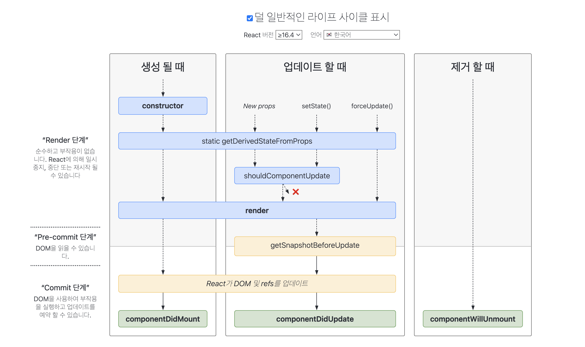

# 7.0 라이프사이클 메서드
모른 리액트 컴포넌트에는 라이프사이클이 존재한다. 
<br>
컴포넌트의 수명은 페이지에 렌더링 되기 전인 준비 과정부터 시작하여 페이지에서 사라질 때 수명이 끝난다.
<br>
<br>
가끔 컴포넌트를 처음 렌더링할때 
1. 어떤 작업을 처리해야하거나 
2. 컴포넌트를 업데이트 하기 전후로 어떤 작업을 처리해야할 수도 있고
3. 불필요한 업데이트를 방지해야하는 일이 생기게 된다.
<br>


이떄 컴포넌트의 라이프사이클 메서드를 사용할 수 있다. 참고로 라이프사이클 메서드는 **클래스형 컴포넌트에서만 사용**이 가능하다. 
<br>
(함수 컴포넌트에서는 hooks 기능을 사용하여 비슷한 처리를 할 수 있다.)

<br>
<br>

# 7.1 라이프사이클 메서드의 이해
라이프사이클 메서드 종류는 총 9가지다.
- will 접두사가 붙은 메서드 : 어떤 작업을 작동하기 **전**에 실행되는 메서드
- Did 접두사가 붙은 메서드 : 어떤 작업을 작동한 **후**에 실행되는 메서드

<br>
이러한 메서드는 컴포넌트 클래스에서 덮어 써 선언해줌으로 사용할 수 있다.

<br>

라이프사이클은 총 3가지로 카테고리를 나눌 수 있다.

- 생성될 때 (마운팅)
- 업데이트 될 때 (업데이팅)
- 제거할 때 (언마운팅)





https://projects.wojtekmaj.pl/react-lifecycle-methods-diagram/

<br>

## 마운트
dom이 생성되고 웹 브라우저상에서 나타나는 것을 마운트라고 한다. 이때 호출하는 메서드는 다음과 같다.
- counstructor : 컴포넌트를 새로 만들 떄마다 호출되는 클래스 생성자 메서드
- getDerivedStateFromProps : props에 있는 값을 state에 넣을 때 사용하는 메서드
- render : ui 렌더링 메서드
- componentDidMount : 컴포넌트가 웹 브라우저상에 나타난 후에 호출하는 메서드

<br>

## 업데이트
컴포넌트는 다음과 같은 네가지 경우에 업데이트를 한다.
1. 부모 컴포넌트에서 넘겨주는 props가 바뀔 때
2. 자신이 들고 있는 state가 setState를 통해 바뀔 때
3. 부모 컴포넌트가 리렌더링 될 때
4. this.forceUpdate로 강제로 렌더링을 트리거할 때


- getDerivedStateFromProps : 이 메서드는 마운트 과정에서도 호출되고, 업데이트가 시작하기 **전**에도 호출된다. props의 변화에 따라 state값에도 변화를 주고 싶을 때 사용한다.
- shouldComponentUpdate : 컴포넌트가 리렌더링을 할지 말지 결정하는 메서드. 이 메서드에서는 **true or false** 둘중 하나를 반환해야한다. true반환 시 다음 라이프사이클 메서드를 계속실행하고, false반환 시 작업을 중지하여 컴포넌트가 리렌더링되지 않는다. 만약 특정함수에서 this.forceUpdate() 함수를 호출하면 이 과정을 생략하고 바로 render함수를 호출한다.
- render : 컴포넌트 리렌더링한다.
- getSnapshotBeforeUpdate : 컴포넌트 변화를 dom에 반영하기 **바로 직전**에 호출하는 메서드
- componentDidUpdate : 컴포넌트의 업데이트 작업이 끝난 후 호출하는 메서드


>this.forceUpdate : React의 상태(state)나 속성(props)이 변경되었지만, 컴포넌트가 이를 감지하지 못하고 다시 렌더링(render)되지 않았을 때, 강제로 컴포넌트를 다시 렌더링하도록 유발하는 메서드다.


<br>

## 언마운트
컴포넌트를 dom제거하는 과정이다.
- componentWillUnmonut : 컴포넌트가 웹 브라우저상에서 사라지기 전에 호출하는 메서드


<br>

# 7.2 라이프사이클 메서드 살펴보기

## render : ui 렌더링해주는 필수 메서드
이 메서드 안에서 this.props와 this.state에 접근할 수 있으며, 리액트 요소를 반환한다.
아무것도 보여주고 싶지 않을 때 null이나 false를 반환해준다.

### 주의점 
이벤트 설정이 아닌 곳에서 setState를 사용하면 안되며, 브라우저 dom에 접근해서도 안된다. dom정보나 state변화를 줄때는 componentDidmount에서 처리해야한다.

- setState() 사용 제한: setState()를 호출하면 컴포넌트가 다시 렌더링되는데, render() 메서드 내에서 setState()를 호출하면 무한 루프에 빠질 수 있다.
- DOM 접근 제한: React는 가상 DOM을 사용하여 실제 브라우저 DOM과 효율적으로 상호작용하다보니 render() 메서드 내에서 직접 브라우저 DOM에 접근하는 것은 React의 가상 DOM 개념을 무시하는 것이 되어 성능을 해친다.

```javascript
class Example extends Component {
  render() {
    return <div>리액트 컴포넌트</div>
  }
}
```

## counstructor : 컴포넌트를 새로 만들 때마다 호출되는 클래스 생성자 메서드
React 컴포넌트의 constructor는 해당 컴포넌트가 생성시에 호출되며 초기 state값을 정할 수 있다.
Component를 상속한 컴포넌트의 생성자를 구현할 때는 다른 구문에 앞서 super(props)를 호출해야한다. 그렇지 않으면 this.props가 생성자 내에서 정의되지 않아서 버그가 생길 수 있다. this.props, this.state에 접근이 가능하고 리액트 요소를 반환합니다.
```javascript
class MyComponent extends Component{
  constructor(props){
    super(props)
    //...
  }
}
```


## getDerivedStateFromProps : props에 있는 값을 state에 넣을 때 사용하는 메서드
리액트 16.3v 이후에 나온 새로운 메서드이며, props로 받아온 값을 state에 동기화시키는 용도로 사용하며, 컴포넌트가 마운트 될 때와 업데이트 될 때 호출됩니다.

```javascript
static getDerivedStateFromProps(nextProps, prevProps) {
    /** 조건에 따라 특정 값 동기화 */
    if(nextProps.value !== prevState.value) { 
        return {value : nextProps.value}
    }
    return null; // state를 변경할 필요가 없다면 null 변환
}
```


## componentDidMount : 컴포넌트가 웹 브라우저상에 나타난 후에 호출하는 메서드
이 메서드는 컴포넌트를 만들고 첫 렌더링을 마친 후 실행한다. 오직 초기 컴포넌트의 로딩 이후에 한번만 실행되는 라이프사이클 메소드입니다. 이제 여기서 DOM을 직접 조작할 수 있게 된다. 이 안에서 다른 자바스크립트 라이브러리 또는 프레임워크 함수 호출하거나 이벤트 등록 등 비동기 처리가 가능하다.

```javascript

class MyComponent extends Component {
  componentDidMount() {
    console.log('컴포넌트가 마운트되었습니다.');
  }

  render() {
    return (
      <div>
        <h1>Hello, World!</h1>
      </div>
    );
  }
}

export default MyComponent;
```

## shouldComponentUpdate : 컴포넌트가 리렌더링을 할지 말지 결정하는 메서드
props나 state를 변경했을 때 리렌더링을 시작할지 여부를 지정하는 메서드. 이 메서드에서는 반드시 true나 false값을 반환해야한다. 이 메서드를 따로 생성하지 않을 시 기본 디폴트 값은 true를 반환한다. false값을 반환하면 업데이트 과정은 중지된다.
<br>
이 메서드 안에서 현재 props와 state는 this.props와 this.state로 접근하고 새로 설정될 props또는 state는 nextProps와 nextState로 접근할 수 있다.

```javascript
class MyComponent extends Component {
  shouldComponentUpdate(nextProps, nextState) {
    // 현재 props와 새로 설정될 props를 비교하여 리렌더링 여부 결정
    if (this.props.someProp !== nextProps.someProp) {
      // someProp이 변경되었을 때에만 리렌더링
      return true;
    }
    // state의 변경이나 다른 조건에 따라서도 true 또는 false 반환 가능
    return false;
  }

  render() {
    return (
      <div>
        <h1>{this.props.someProp}</h1>
      </div>
    );
  }
}

export default MyComponent;
```

## getSnapshtBeforeUpdate : 컴포넌트 변화를 dom에 반영하기 **바로 직전**에 호출하는 메서드
리액트 16.3v 버전 이후에 나온 메서드로, render에서 만들어진 결과물이 실제 브라우저에 반영되기 직전에 호출된다. 
<br>
이 메서드에서 반환하는 값은 세번째 파라미터인 snapshot값으로 전달받을 수 있는데, 주로 업데이트하기 직전의 값을 참고할일이 있을 떄 활용된다.

```javascript
getSnapshotBeforeUpdate(prevProps,prevState) {
    if(prevState.array !== this.state.array) {
        const {scrollTop, scrollHeight} = this.list
        return {scrollTop, scrollHeight}
    }
}
```

## componentDidUpdate : 컴포넌트의 업데이트 작업이 끝난 후 호출하는 메서드
업데이트가 완료된 후 실행되며, 업데이특 끝난 직후기때문에 dom관련 처리를 해도 무방하다.
<br>
prevProps,prevState사용하여 컴포넌트가 이전에 가졌던 데이터에 접근도 할 수 있다. 
<br>
반환할 값이 필요하면 snapshot값을 전달 받을 수 있다.

```javascript
class MyComponent extends Component {
  componentDidUpdate(prevProps, prevState) {
    // 이전 props와 현재 props를 비교하여 변경된 내용을 콘솔에 출력
    console.log('이전 props:', prevProps);
    console.log('현재 props:', this.props);
  }

  render() {
    return (
      <div>
        <h1>Hello, {this.props.name}!</h1>
      </div>
    );
  }
}

export default MyComponent;
```

## componentWillUnmount - 컴포넌트가 웹 브라우저상에서 사라지기 전에 호출하는 메서드
해당 컴포넌트를 dom에서 제거할 때 실행하며, componentDidMount에서 실행한 이벤트, 타이머, dom 등등이 있다면 여기서 제거 작업을 해야한다.

## componentDidCatch - 컴포넌트 렌더링 도중에 에러가 발생했을 때 오류 UI를 보여줄 수 있게 하는 메서드

```javascript
componentDidCatch(error,info){
    this.setState({
        error: true
    })
    console.log({error,info})
}
```
여기서 error는 파라미터에 어떤 에러가 발생했는지 알려주며, info 파라미터는 어디에 잇는 코드에서 오류가 발생햇는지에 대한 정보를 알려준다. 나중에 실제로 사용할 때 오류가 발생하면 서버 api를 호출하여 따로 수집할수도 있다.
<br>
하지만 유의점은 컴포넌트 자신에게 발생하는 에러는 잡아낼 수 없고, 자신의 this.props.childrend으로 전달되는 컴포넌트에서 발생하는 에러만 잡아낼 수 있다.