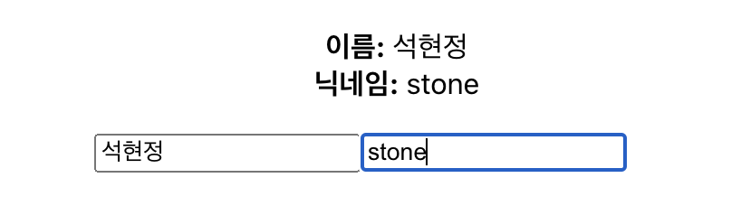
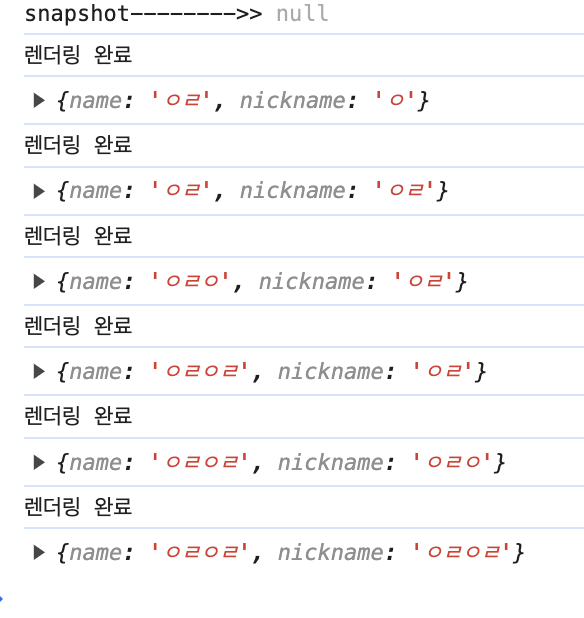
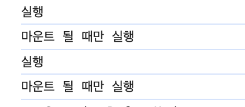
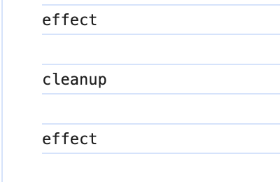
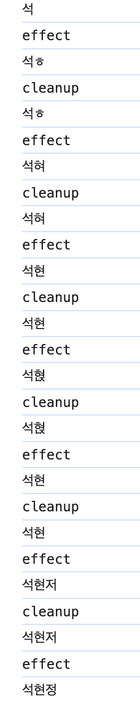
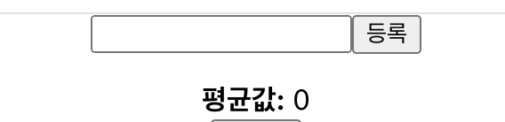
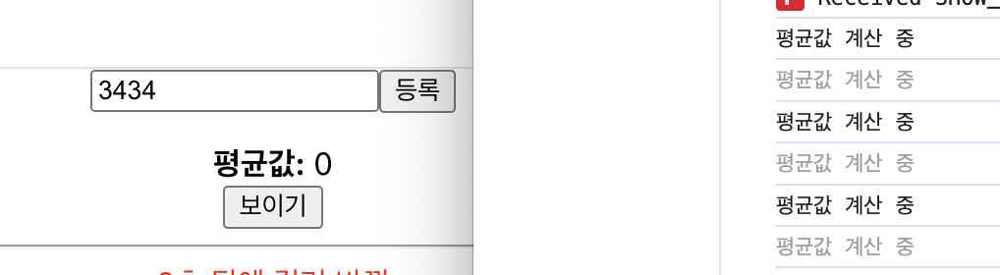

# 8장. Hooks
*2024/2/13 8장 정리*
* * *
Hooks는 기존 함수 컴포넌트에서도 다양한 작업을 할 수 있게끔 새로 도입된 기능이다.

***
## useState
```javascript
const [value, setValue] = useState(0);
```
1. useState 함수의 파라미터에는 상태의 기본값을 넣어준다.<br>
(위 예시로 살펴보면, 상태 기본값은 숫자 0 이다.)

2. 위 함수가 호출되면 배열을 반환하는데, 배열의 첫번째 원소(value)는 상태 값, 두번째 원소(setValue)는 상태를 설정하는 함수이다.

3. 함수에 파라미터를 넣어서 호출하면, 전달받은 파라미터로 값이 바뀌고 컴포넌트가 정상적으로 리렌더링 된다.

### useState를 활용한 코드 예시를 보자면,
```javascript
import {useState} from "react";

const Counter = () => {
    const [value, setVaule ] = useState(0);

    return (
        <div>
            <p>현재 카운터 값은 <b>{value}</b>입니다.</p>
            <button onClick={() => setVaule(value +1)}>+1</button>
            <button onClick={() => setVaule(value -1)}>-1</button>
        </div>
    )
};

export default Counter;
```
#### View


### useState 여러 번 사용한 예시를 보자면,
```javascript
import {useState} from "react";

const Info = () => {
    const [name, setName] = useState('');
    const [nickname, setNickname] = useState('');

    const onChangeName = e => {
        setName(e.target.value);
    };

    const onChangeNickname = e => {
        setNickname(e.target.value);
    };

    return (
        <>
            <ul>
                <li>
                    <b>이름:</b> {name}
                </li>
                <li>
                    <b>닉네임:</b> {nickname}
                </li>
            </ul>
            <div>
                <input type="text" value={name} onChange={onChangeName}/>
                <input type="text" value={nickname} onChange={onChangeNickname}/>
            </div>
        </>
    )
}

export default Info;
```
#### View


***
## useEffect
useEffect는 리액트 컴포넌트가 렌더링될 때 마다 특정 작업을 수행하도록 설정할 수 있는 Hook이다.<br>
(클래스형 componentDidMount + componentDidUpdate 합친 것과 동일)
```javascript
import {useState, useEffect} from "react";

const Info = () => {
    useEffect(() => {
        console.log('렌더링 완료');
        console.log({
            name, nickname
        });
    });
}

export default Info;
```


> #### console에 2번찍히는 이유! [React.StrictMode] 
> 1. useEffect를 사용한 코드에 문제 유/무를 감지하기 위해 2번 실행 된다.
> 2. 컴포넌트가 사라지고 다시 나타나도 컴포넌트의 상태를 유지하는 기능이 도입되었을 때 컴포넌트가 나타날 때 useEffect가 두번 실행이 되어도 컴포넌트 작동 방식에 문제가 없어야 추후 호환이 정상적으로 이루어진다고한다.


### useEffect 마운트될 때만 실행하고 싶다면,
useEffect에서 설정한 함수를 컴포넌트가 화면에 맨 처음 렌더링 될 때만 실행하고, 업데이트 될 때는 실행하지 않으려면 함수의 두 번째 파라미터로 비어 있는 배열을 넣어주면 된다.
```javascript
import {useState, useEffect} from "react";

const Info = () => {

    useEffect(() => {
        console.log('마운트 될 때만 실행');
    }, []);
}

export default Info;
```


### 특정 값이 업데이트 될 때만 실행하고 싶다면,
```javascript
 useEffect(() => {
    console.log(name);
},[name] );
```
useEffect 두번 째 파라미터로 전달되는 배열 안에 검사하고 싶은 값을 넣으면 된다.(name)

### 두번째 파라미터 배열 조건
```javascript
//자식 컴포넌트 Info
useEffect(() => {
    console.log('effect');
    return () => {
        console.log('cleanup');
    }
},[] );
```
```javascript
//부모 컴포넌트 App
function App() {
    const [visible, setVisible] = useState(false);
    return (
        <div>
            <button onClick={() => {
                setVisible(!visible);
            }}>{visible ? '숨기기':'보이기'}</button>
            <hr/>
            {visible && <Info/>}
        </div>
    )
}
```
React.StrictMode가 활성화 되어있기 때문에, effect, cleanup, effect가 출력된다.


렌더링될 때마다 뒷정리 함수가 계속 호출되는데, 


언마운트 될 때만 호출하고 싶다면 위에서 이야기했듯 두번째 파라미터에 빈 배열을 넣으면 된다.

***
## useReducer

useState보다 더 다양한 컴포넌트 상황에 따라 다양한 상태를 다른 값으로 업데이트 하고 싶을 때 사용하는 기능.
> **리듀서(reducer)**
> 1. 리덕스에서 사용
> 2. 현재 상태, 그리고 업데이트를 위해 필요한 정보를 담은 액션값을 전달받아 새로운 상태를 반환하는 함수<br>(리듀서 함수에서 새로운 상태를 만들 때는 반드시 불변성을 지켜야 함)

### useState 카운터 구현한것을 useReducer로 바꾸면,

```javascript
import {useReducer} from "react";


function reducer(state, action){
    switch (action.type) {
        case 'INCREMENT':
            return {value: state.value + 1};
        case 'DECREMENT':
            return {value: state.value - 1};
        default:
            return state;
    }
}
const Counter = () => {
    const [state, dispatch] = useReducer(reducer, {value: 0})

    return (
        <div>
            <p>
                현재 카운터 값 <b>{state.value}</b>
            </p>
            <button onClick={() => dispatch({ type: 'INCREMENT'})}>+1</button>
            <button onClick={() => dispatch({ type: 'DECREMENT'})}>+1</button>
        </div>
    )
};

export default Counter;
```
>useState 보다 코드길이가 훨씬 길어지기 때문에, 간단한 카운터 작업은 useState로 쓸거같다.

***
## useMemo
useMemo를 사용하면 함수 컴포넌트 내부에서 발생하는 연산을 최적화 할 수 있다.
### 숫자들의 평균을 보여주는 함수 컴포넌트로 예시를 들면,
```javascript
import {useMemo, useState} from "react";

const getAverage = numbers => {
    console.log('평균값 계산 중')
    if (numbers.length === 0) return 0;
    const sum = numbers.reduce((a, b) => a + b);
    return sum / numbers.length;
}

const Average = () => {
    const [list, setList] = useState([]);
    const [number, setNumber] = useState('');

    const onChange = e => {
        setNumber(e.target.value);
    }
    const onInsert = () => {
        const nextList = list.concat(parseInt(number));
        setList(nextList)
        setNumber('')
    }

    return (
        <>
            <input type="text" value={number} onChange={onChange}/>
            <button onClick={onInsert}>등록</button>
            <ul>
                {list.map((value, index) => (
                    <li key={index}>{value}</li>
                ))}
            </ul>
            <div>
                <b>평균값:</b> {getAverage(list)}
            </div>
        </>
    )
}

export default Average;
```



위 코드로 나오는 인풋에 숫자를 입력하게되면, <br/>
입력할 때마다 함수가 호출되고 있다.

> 이렇게 불필요한 렌더링을 막고자, useMemo를 사용한다. 
> ##### useMemo는 값이 바뀌었을 때만 연산을 실행하고, 원하는 값이 바뀌지 않았다면 이전에 연산했던 결과를 다시 가져온다.

```javascript
const avg = useMemo(() => getAverage(list), [list])

    return (
        <>
            <input type="text" value={number} onChange={onChange}/>
            <button onClick={onInsert}>등록</button>
            <ul>
                {list.map((value, index) => (
                    <li key={index}>{value}</li>
                ))}
            </ul>
            <div>
                <b>평균값:</b> {avg}
            </div>
        </>
    )
```
> list 배열의 내용이 바뀔 때만 getAverage 함수가 호출되도록 한다.

***
## useCallback
1. 첫 번째 파라미터 : 생성하고 싶은 함수
2. 두 번째 파라미터 : 배열 -> 어떤 값이 바뀌었을 때 함수를 새로 생성해야 하는지 명시해야함

```javascript
import {useMemo, useState, useCallback} from "react";

const getAverage = numbers => {
    console.log('평균값 계산 중')
    if (numbers.length === 0) return 0;
    const sum = numbers.reduce((a, b) => a + b);
    return sum / numbers.length;
}


// useMemo 사용 시
const Average = () => {
    const [list, setList] = useState([]);
    const [number, setNumber] = useState('');

    // const onChange = e => {
    //     setNumber(e.target.value);
    // }
    
    const onChange = useCallback(e => {
        setNumber(e.target.value);
    }, []) // 컴포넌트가 처음 렌더링될 때만 함수 생성
    
    // const onInsert = () => {
    //     const nextList = list.concat(parseInt(number));
    //     setList(nextList)
    //     setNumber('')
    // }
    const onInsert = useCallback(() => {
        const nextList = list.concat(parseInt(number));
        setList(nextList)
        setNumber('');
    }, [number, list]) // number 혹은 list가 바뀌었을 때만 함수 생성

    const avg = useMemo(() => getAverage(list), [list])

    return (
        <>
            <input type="text" value={number} onChange={onChange}/>
            <button onClick={onInsert}>등록</button>
            <ul>
                {list.map((value, index) => (
                    <li key={index}>{value}</li>
                ))}
            </ul>
            <div>
                <b>평균값:</b> {avg}
            </div>
        </>
    )
}

export default Average;
```
> * onChange 처럼 비어 있는 배열을 넣게 되면 컴포넌트가 렌더링될 때 만들었던 함수를 계속해서 재 사용함
> * onInsert 처럼 배열 안에 number와 list를 넣게 되면 인풋 내용이 바뀌거나, 새로운 항목이 추가 될 때 새로 만들어진 함수를 사용함
> * 함수 내부에서 상태 값에 의존해야 할 때 그 값을 반드시 두 번째 파라미터 안에 넣어줘야 함 (onInsert는 기존 number와 list를 조회해서 nextList를 생성시키기 때문)

***
## useRef
useRef는 함수 컴포넌트에서 ref를 쉽게 사용하기 위함.
```javascript
import {useMemo, useState, useCallback, useRef} from "react";

const getAverage = numbers => {
    console.log('평균값 계산 중')
    if (numbers.length === 0) return 0;
    const sum = numbers.reduce((a, b) => a + b);
    return sum / numbers.length;
}


// useMemo 사용 시
const Average = () => {
    const [list, setList] = useState([]);
    const [number, setNumber] = useState('');
    const inputEl = useRef(null); //ref
    
    const onChange = useCallback(e => {
        setNumber(e.target.value);
    }, []) 
    
    const onInsert = useCallback(() => {
        const nextList = list.concat(parseInt(number));
        setList(nextList)
        setNumber('');
        inputEl.current.focus(); //ref
    }, [number, list])

    const avg = useMemo(() => getAverage(list), [list])

    return (
        <>
            <input type="text" value={number} onChange={onChange} ref={inputEl}/> 
            <button onClick={onInsert}>등록</button>
            <ul>
                {list.map((value, index) => (
                    <li key={index}>{value}</li>
                ))}
            </ul>
            <div>
                <b>평균값:</b> {avg}
            </div>
        </>
    )
}

export default Average;
```
> 위 코드에 useRef를 사용하여서 ref를 설정하면, useRef를 통해 만든 객체 안의 current 값이 실제 엘리먼트를 가리킴(input 태그)


